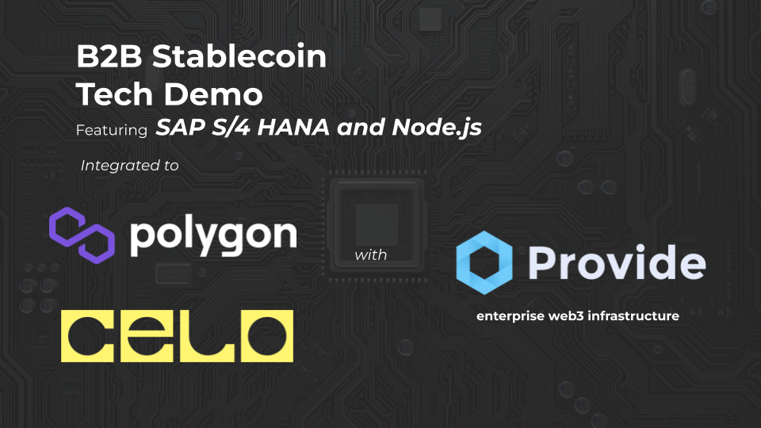
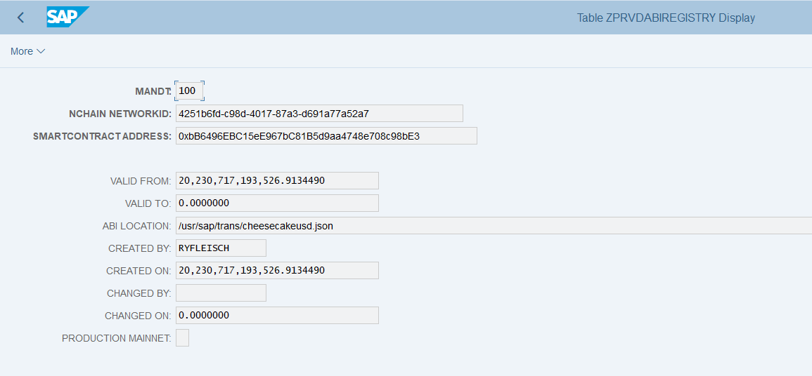

# abap-erc-20
Send stablecoins, CBDCs, and other ERC-20 tokens in SAP ABAP with Provide



## Pre requisites (do these first before running code!)
- Clone [provide-abap](https://github.com/provideplatform/provide-abap) to your SAP system
- Activate the prvd SICF node (formerly proUBC)
- In transaction code STRUST, configure the SSL certificates needed for Provide stack (see certificates directory of the prvd repo)
- Create an account at https://shuttle.provide.services. Create organization at minimum (workgroup creation is recommended but optional)


## Setup

Sign up for [Provide Shuttle account](https://shuttle.provide.services). You'll need to create an organization id. Once this is created, you can proceed to generate API credentials to your SAP system. 

### Postman configuration - credentials creation
- Import the provided Postman collection. 
- Maintain the shuttle_email and shuttle_password collection variables accordingly
- Maintain SAP user id and password in the Postman collection
- Enter the web dispatcher base url (ex: fiorilaunchpad.mycompany.com) to the sapbaseurl collection variable
- Run the HTTP requests in the following order:
1. Get access token with login
2. List organizations
3. Generate long-dated refresh token
4. Get access token from refresh token
5. Create account (Do both Polygon Mumbai and Celo Alfajores)
6. List accounts (take note of the address field for later!)
7. SAP / prvd fetch token
8. SAP / prvd tenants create

Steps 7 an 8 populate your Provide credentials to the SAP system. 

### Wallet configuration
Create Polygon, Celo testnet accounts and acquire testnet gas tokens through faucet. Note if you did this previously with [abap-NFT](https://github.com/fleischr/abap-nft) or created accounts with [stablecoin provide-js example](https://github.com/fleischr/transfer-erc20-providejs) or [nft provide-js example](https://github.com/fleischr/mint-nft-provide-js) - you should already be set.

For these self-custody transactions, you'll need some gas tokens to complete the NFT mint transaction. Use the wallet addresses you noted earlier to request gas from the given network testnet faucet.

Polygon Mumbai : https://faucet.polygon.technology 

Celo Alfajores : https://faucet.celo.org/alfajores

Acquire an inital batch of chUSD to work with. Send email to ryan@provide.services to receive some.

On-board Shuttle credentials to SAP through Postman

### Additional SAP configuration
- Upload the [given ABI file](./abi/cheesecakeusd.json) via AL11/CG3Z and create ABI registry entry for the contract / network
- Maintain the following entries in the zprvdabiregistry table. This can be done via execution of the class method zcl_prvd_file_helper=>update_abi_registry (be sure to check case sensitive)
In SAP





## Sending the chUSD stablecoin in ABAP
- Open the report ```zprvd_send_stablecoins```
- Run with either the following sets of parameters
- Polygon Mumbai
    1. Network ID : 4251b6fd-c98d-4017-87a3-d691a77a52a7
    2. Contract address : 0xbB6496EBC15eE967bC81B5d9aa4748e708c98bE3
    3. Recipient : Send to a friend! 
- Celo Alfajores
    1. Network ID : d818afb9-df2f-4e46-963a-f7b6cb7655d2
    2. Contract address : 0x55bD95969c9F5297688B6115f2b984e2daF0359e
    3. Recipient : Send to a friend! 

## Reviewing the results
After successfully running the NFT mint - check out the smart contract activity on th block explorers of the given network
Polygon Mumbai: https://mumbai.polygonscan.com/address/0xbB6496EBC15eE967bC81B5d9aa4748e708c98bE3
Celo Alfajores: https://alfajores.celoscan.io/address/0x55bD95969c9F5297688B6115f2b984e2daF0359e


## Bonus : Send a stablecoin / ERC-20 in Javascript/Typescript with provide-js
For comparison sake - check out [this repo](https://github.com/fleischr/transfer-erc20-providejs) to see a similar integration in Javascript/Typescript to mint NFTs using the provide-js library


## Special thank yous!
Huge thanks to [Nuve](https://nuveplatform.com/)!
Highly recommended to take your ABAP development to a whole new level of sophistication with abapGit, CI/CD, system versioning and more :)